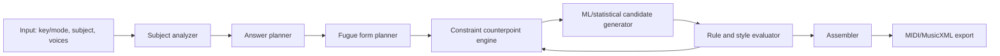

# 可行性与研发方案

更新时间：2026-05-24。

## 2. 自行完成是否可行？

结论：可行，但应把目标分为“可听、守规矩的练习赋格”和“接近 Bach 大师级赋格”。前者适合本项目推进，后者不适合作为第一阶段承诺。

数据确实有限。严格的 Bach WTC fugue 只有 48 首，哪怕经过转调扩增，也远小于现代深度学习通常需要的数据量；同时赋格规则很多，错误很容易被听出来。因此纯 transformer/端到端 MIDI 生成风险很高。可行路线是 hybrid symbolic AI：

1. 先用规则系统规划结构，保证 subject/answer/entry/key plan 合法。
2. 用约束求解生成 exposition 和局部 counterpoint。
3. 用小规模统计/神经模型生成候选 episode、自由声部和连接材料。
4. 用 music-theory evaluator 过滤、打分、重采样。

## 推荐总体架构

## 模块说明

### 主题分析器

输入 MIDI/MusicXML 后，标准化为离散网格：

- pitch class、scale degree、duration、metrical strength。
- 主题 ambitus、起止音、最高/最低点、dominant/tonic 倾向。
- 是否适合 tonal answer；例如 subject 强调 scale degree 5/1 时，answer 常需调整以避免持续转调。
- 是否适合 stretto、augmentation、diminution、inversion。

### 赋格骨架规划

第一阶段只做清晰、稳定的 school fugue：

- 3 voices: S-A-B 或 A-S-B entry order；exposition 通常 subject-answer-subject。
- 4 voices: S-A-T-B 或 A-S-T-B；subject/answer 交替。
- middle entries 走近关系调：major 可去 V、vi、ii/IV；minor 可去 v/V、relative major、iv。
- episode 基于 subject 尾部或 countersubject 动机做 sequence。
- final section 回主调，可加入 dominant pedal、stretto 或加密 subject entry。

### 约束对位引擎

建议先用 Python + `music21` + `z3-solver`/自写 beam search，而不是一开始训练大模型。

硬约束：

- 声部音域：S/A/T/B 或键盘三声部音域。
- 禁止明显 parallel fifth/octave/unison。
- 限制 hidden/direct perfect intervals，尤其外声部同向大跳。
- 限制 voice crossing/overlap。
- 不协和音必须作为 passing、neighbor、suspension 等合法类型处理，并按节拍强弱约束解决。
- 终止式必须在目标调中完成。
- subject entry 区间固定，其他声部不得破坏主题可辨认性。

软约束：

- 旋律线平稳、跳进后反向级进补偿。
- 声部密度适中，休止与进入安排自然。
- 和声节奏与目标风格匹配。
- 动机复用率、sequence 清晰度。
- 避免过多重复音、机械音型和过窄音域。

### 小数据 ML 策略

不要直接训练“从 subject 到完整 fugue”的模型。推荐三个更小的学习目标：

1. `counterpoint infill`: 给定 subject/countersubject mask 和若干固定声部，补全空白声部。
2. `episode continuation`: 给定一到两小节动机和目标调，生成可转调 episode 候选。
3. `candidate ranking`: 对约束搜索产生的候选小节排序，学习 Bach/WTC 的局部风格偏好。

训练数据扩增：

- 所有 WTC fugues 做全调转置，限制到合理音域后保留。
- 切成 1、2、4 小节窗口，保留声部标签、调性、节拍强弱。
- 从 subject entry 周围抽取正样本，从规则扰动生成负样本，用于 ranking。
- 用 JSB chorales 预训练基础四声部和声/声部进行，再用 WTC fugues 微调。

## 里程碑

### M0: 环境与语料

- 建立 Python 3.12 工程、docs、下载脚本。
- 下载 WTC fugue Humdrum corpus、WTC corpus、JSB chorales。
- 写 parser，把 Humdrum/MusicXML/MIDI 统一成内部 `ScoreGrid`。

### M1: 主题与 exposition MVP

- 支持输入单声部主题 MIDI。
- 生成 real/tonal answer。
- 输出 3/4 声部 exposition MIDI。
- 规则检查器能报告 parallel fifth/octave、crossing、range、entry completeness。

### M2: 完整规则赋格

- 生成 24-60 小节短赋格。
- 至少包含 exposition、2-4 个 middle entries、episodes、final entry、cadence。
- 支持 major/minor，其他调式先映射到 modal scale + tonal cadence 的折中策略。

### M3: ML 辅助候选生成

- 训练小型 inpainting 或 ranking model。
- 用模型参与 episode/free-voice 候选排序，不让模型直接绕过规则。
- 加入 temperature/seed 以生成多版本。

### M4: 质量评估与接口

- CLI: `fugue generate --key C --mode minor --voices 4 --subject subject.mid --out out.mid`
- 输出 MIDI + 可选 MusicXML。
- 生成评估报告：规则违反数量、subject entry 表、调性路线、音域统计。

## 风险与缓解

| 风险 | 影响 | 缓解 |
| --- | --- | --- |
| 赋格数据少 | 端到端模型过拟合、生成机械 | 规则骨架 + 片段级学习 + 转调扩增 |
| Humdrum/MIDI 声部解析复杂 | 数据清洗耗时 | 先以 `bach-wtc-fugues` 的 voice-separated spines 为主 |
| 规则过多导致搜索爆炸 | 生成慢或无解 | 先规划 chord/key skeleton，再小窗口 beam search |
| 主题本身不适合赋格 | 无法生成自然 answer/countersubject | 主题诊断并给出修改建议，必要时生成“近似可赋格化”主题 |
| 输出听感僵硬 | 符合规则但不音乐 | ML ranking、动机复用约束、人工评估循环 |

## 第一版实现建议

第一版不要训练大模型。先完成：

- `ScoreGrid` 数据结构。
- `SubjectAnalyzer`。
- `AnswerPlanner`。
- `FormPlanner`。
- `CounterpointEvaluator`。
- `BeamSearchComposer`。
- `MidiExporter`。

当规则版能稳定生成 exposition 和短赋格后，再把 ML 插进候选生成/排序层。这样即便模型效果一般，系统仍能输出结构正确的 MIDI。

## 质量目标

MVP 合格标准：

- 100% 声部 entry 与设定声部数一致。
- subject/answer 在 exposition 中可辨认。
- 每 100 小节 parallel fifth/octave 硬错误为 0。
- voice crossing 每首不超过 1 次，且可解释为键盘织体。
- 终止在目标主调，最后 cadence 清晰。

研究版目标：

- 生成 5 个候选版本，自动评分并选最佳。
- 与 WTC fugues 的音域、节奏密度、interval distribution、cadence 位置有相近统计。
- 人听评估中，至少达到“像一个认真学生写出的赋格草稿”。

